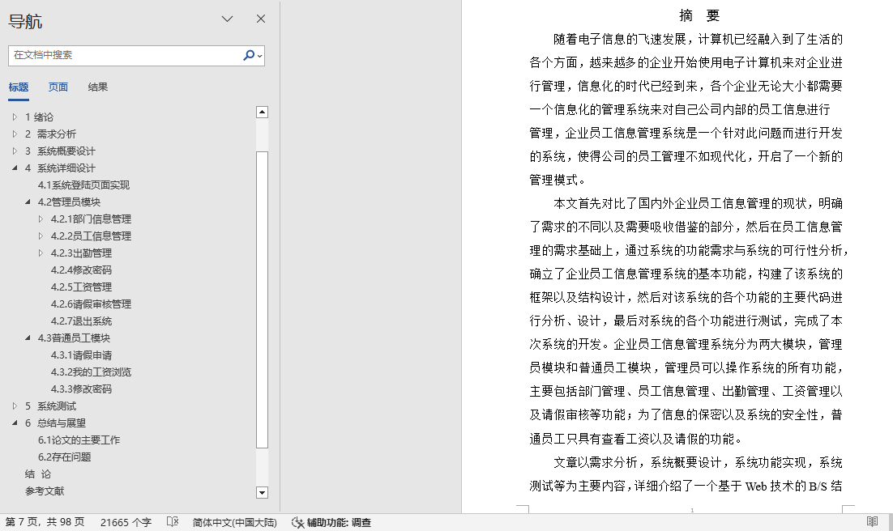

## 基于JSP+Servlet实现的企业员工信息管理系统(程序+报告)

- <b>完整代码获取地址：从戎源码网 ([https://armycodes.com/](https://armycodes.com/))</b>
- <b>技术探讨、资料分享，请加QQ群：692619798</b> 
- <b>作者微信：19941326836  QQ：952045282</b> 
- <b>承接计算机毕业设计、Java毕业设计、Python毕业设计、深度学习、机器学习</b>
- <b>选题+开题报告+任务书+程序定制+安装调试+论文+答辩ppt 一条龙服务</b>
- <b>所有选题地址 ([https://github.com/YuLin-Coder/AllProjectCatalog](https://github.com/YuLin-Coder/AllProjectCatalog)) </b>

## 项目介绍
基于JSP+Servlet实现的企业员工信息管理系统，主要功能如下

基本功能包括：密码修改、员工管理、部门管理、出勤管理、工资管理、请假审核、我的请假、我的工资等。本系统结构如下：
（1）【管理员】端
	密码修改：修改自己的密码。
	员工管理：对员工的基本信息进行管理,包括查询、删除、录入。
	部门管理：包括添加部门以及添加子部门，删除部门等操作，便于及时更新部门信息。
	出勤管理：用于对员工的出勤月份以及天数进行管理，便于计算员工的工资等。
	工资管理：用于对员工的每个月的工资进行管理，便于对员工的工资进行管理。
	请假审核：用于管理员对员工的请假进行审核并加以回复，便于对员工的请假进行管理。
（2）【员工】端
	密码修改：修改自己的密码。
	我的请假：查看请假记录和发起请假申请。
	我的工资：查看员工自己的工资记录。

## 项目技术
- 编程语言：Java
- 数据库：MySQL
- 前端技术：JSP、JavaScript、bootstrap、JQuery
- 后端技术：Servlet、JDBC

## 运行环境
- JDK版本：JDK1.8及以上
- 开发工具：IDEA、Ecplise、Myecplise都可以
- 数据库: MySQL5.7及以上

## 运行截图

